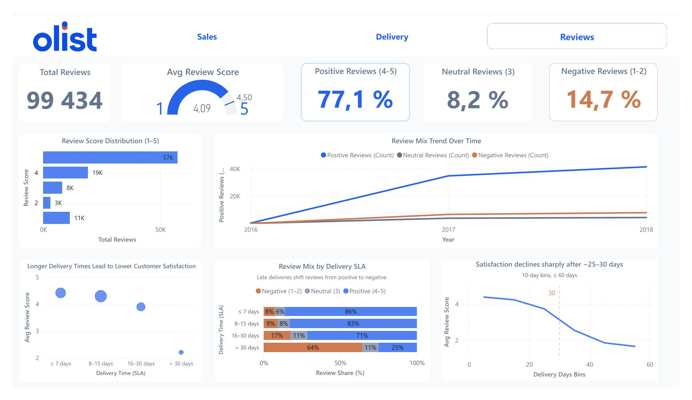
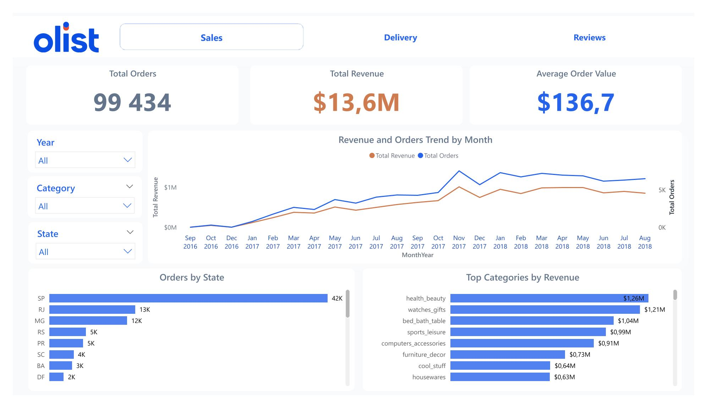
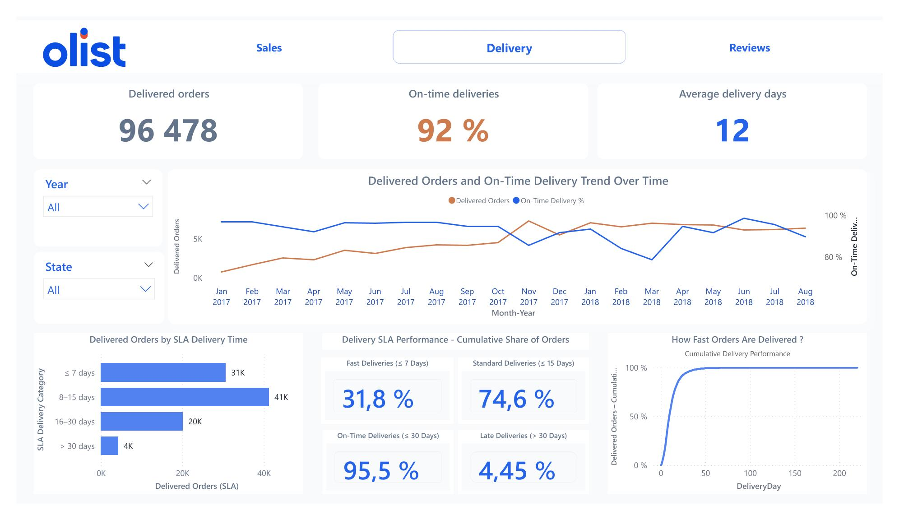
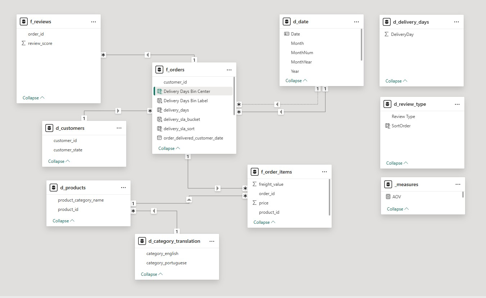

# Olist E-Commerce Analytics - End-to-End Data & BI Project

[🇫🇷 Version française](README.md)

## 🎯 Executive Summary

**End-to-end data analytics project** demonstrating the full pipeline from raw data to decision-ready **Power BI dashboards**. Built on the public [Olist Brazilian E-Commerce Dataset (Kaggle)](https://www.kaggle.com/datasets/olistbr/brazilian-ecommerce), this project covers **data preparation** (Python), **KPI design**, **star-schema modeling**, and **business storytelling** through interactive dashboards.

> **Key insight: deliveries exceeding 30 days generate 64% of negative reviews.** Fast deliveries (≤7 days) account for 86% of positive reviews.


---

## 🧠 Business Questions Addressed

- How does sales performance evolve over time, by category and by region?
- How efficient is delivery performance against SLA commitments?
- What is the relationship between delivery delays and customer satisfaction?
- Where should the business prioritize to reduce negative reviews?

---

## 📸 Dashboards

### Customer Reviews & Satisfaction

**Purpose**: Identify the drivers of customer satisfaction and quantify the impact of delivery performance on review scores.

[](screenshots/reviews_dashboard.jpg)

**KPIs**: Review score distribution, review mix over time, delivery delay vs. satisfaction correlation.

---

### Sales Performance

**Purpose**: Monitor commercial performance, revenue trends, and identify top-performing categories and regions.

[](screenshots/sales_dashboard.jpg)

**KPIs**: Total Revenue, Order Volume, Average Order Value (AOV), monthly trends, top categories and states.

---

### Delivery & Logistics

**Purpose**: Track operational performance, SLA reliability, and identify delivery bottlenecks.

[](screenshots/delivery_dashboard.jpg)

**KPIs**: On-time delivery rate, SLA distribution, cumulative delivery performance, SLA tipping points.

---

## 🏗️ Project Architecture

```
.
├── data_cleaned/              # Analytics-ready datasets (CSV + Parquet)
├── docs/
│   ├── data_models.md         # Analytical data model documentation
│   └── metrics.md             # Business metrics & KPI definitions
├── notebooks/
│   └── main.ipynb             # Python data preparation pipeline
├── powerbi/                   # Power BI project (PBIP format)
├── screenshots/               # Dashboard screenshots
├── README.md
└── .gitignore
```

---

## 🛠️ Technical Stack

| Layer | Tools & Approach |
|---|---|
| **Data Preparation** | Python (Pandas, NumPy), Jupyter Notebook |
| **Data Quality** | Automated checks: PK uniqueness, mandatory fields, business rules (prices ≥ 0, scores 1-5), referential integrity. Pipeline stops on failure. |
| **Data Storage** | Parquet (primary, performance), CSV (fallback, compatibility) |
| **Data Modeling** | Star-schema (fact/dimension), explicit Date dimension, single-direction relationships |
| **BI & Visualization** | Power BI (Import mode), DAX measures centralized by domain, parameterized folder path |

---

## 📊 Power BI Data Model

[](screenshots/data_model.jpg)

- **Star-schema** inspired model optimized for slicing and aggregation
- Explicit **Date dimension** for time intelligence
- Single-direction relationships for predictable filter context
- **DAX measures** centralized by business domain (Sales, Delivery, Reviews)

---

## 🧪 Python Data Preparation Pipeline

Each dataset follows a structured, reproducible pipeline:

1. **Data Profiling** - Schema, data types, missing values analysis, business relevance filtering
2. **Data Cleaning** - Date normalization, status harmonization, numeric validation, SLA computation (delivery time buckets)
3. **Data Quality Controls** - Automated checks with pipeline halt on failure
4. **Export** - Clean datasets in Parquet (primary) and CSV (fallback)

---

## 💡 Key Insights

| Finding | Business Impact |
|---|---|
| Satisfaction drops sharply after ~25-30 days delivery time | Critical SLA threshold identified |
| Deliveries >30 days generate **64% of negative reviews** | Clear root cause for dissatisfaction |
| Deliveries ≤7 days generate **86% of positive reviews** | Fast delivery = strong satisfaction lever |
| Sales concentrated in a small number of states & categories | Prioritization opportunity for logistics |

---

## 💼 Business Recommendations

Based on the analysis of sales performance, delivery SLAs, and customer reviews:

- **Flag orders approaching 20 days** of delivery time and act before the critical 25-30 day threshold
- **Adjust SLA commitments by region** - align customer expectations with actual delivery performance outside major hubs
- **Investigate structurally slow categories** (bulky items, furniture) at supplier and fulfillment level
- **Trigger proactive customer communication** for orders delayed beyond 25 days
- **Use delivery performance as a CX leading indicator** - monitor logistics KPIs alongside review scores as early warning signals

---

## 🎯 Skills Demonstrated

This project demonstrates the following competencies, aligned with **Data Analyst** market requirements:

| Competency | How it is demonstrated |
|---|---|
| **Power BI** (DAX, Power Query, star-schema) | Full dashboard suite with parameterized model |
| **KPI design & dashboarding** | Revenue, delivery, satisfaction KPIs structured by domain |
| **Data visualization & storytelling** | Insight-driven dashboards designed for decision-makers |
| **Python data preparation** | Reproducible pipeline with automated quality controls |
| **SQL-ready data modeling** | Star-schema with controlled grains and referential integrity |
| **Business needs analysis** | Questions framed from the operational perspective, not the tool |

---

## 🔗 Related Projects

This project complements the portfolio alongside:

- 👉 [Olist Analytics Engineering Pipeline](https://github.com/SimonNC/olist-dbt-duckdb) (SQL + dbt)
- 👉 [Customer Churn Prediction - Telco](https://github.com/SimonNC/telco-customer-churn-prediction) (Python + ML + Streamlit)

---

## 👤 Author

**Simon Jorite**
Data Analyst - [Microsoft Certified Power BI Data Analyst (PL-300)](https://learn.microsoft.com/en-us/users/simonjorite-4846/credentials/b2cc3310a92a9302)

15 years of experience in finance, operations, and e-commerce. I transform complex datasets into reliable KPIs and decision-ready dashboards.

- GitHub: [github.com/SimonNC](https://github.com/SimonNC)
- LinkedIn: [linkedin.com/in/simonjorite](https://www.linkedin.com/in/simonjorite)
- Email: simon.jorite@gmail.com
- Location: Lyon, France (Open to hybrid / remote)
- Scheduling: [Book a 30-min exchange](https://calendly.com/simon-jorite/echange-da)
