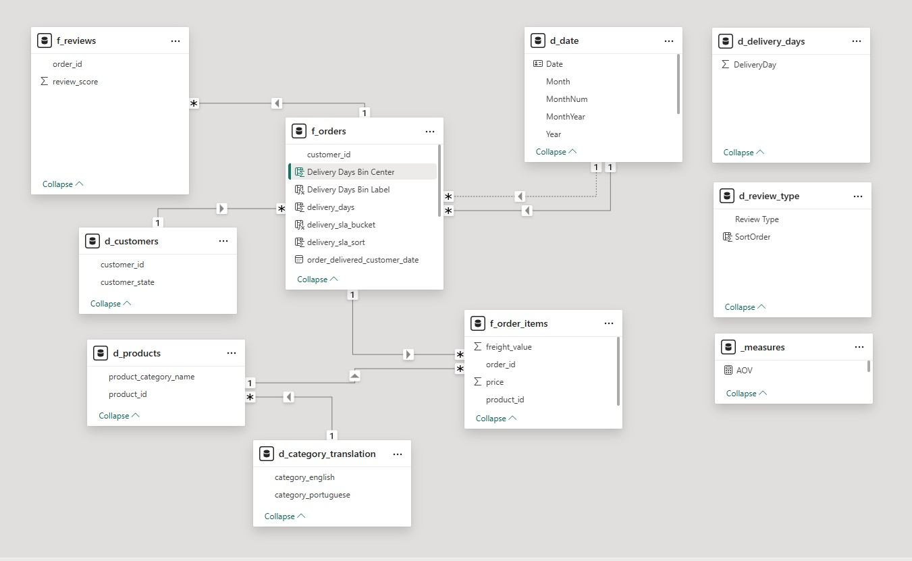
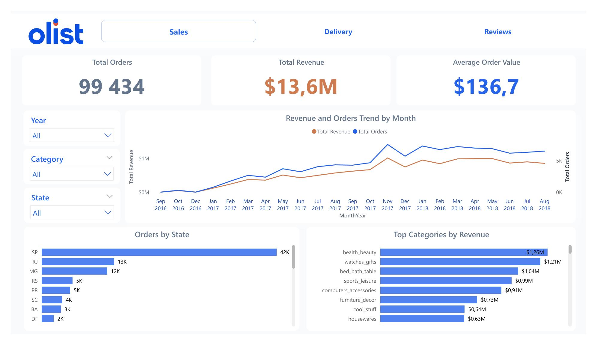
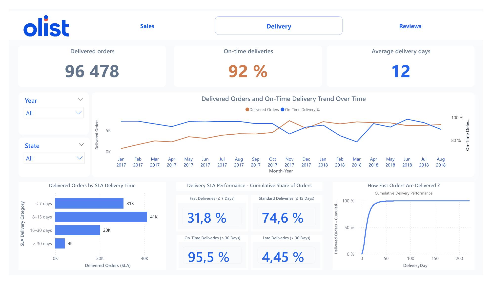
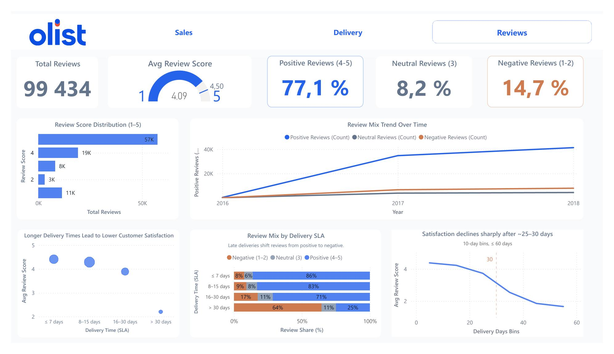

# Olist E-Commerce Analytics — End-to-End Data & BI Project

## 🎯 Executive Summary
This project is a **complete end-to-end data analytics case study** based on the public **[Olist Brazilian E-Commerce Dataset (Kaggle)](https://www.kaggle.com/datasets/olistbr/brazilian-ecommerce)**.
It demonstrates my ability to **transform raw data into business-ready insights**, combining **Python data engineering**, **analytical data modeling**, and **Power BI dashboarding**.

Target audience:
- Recruiters
- Analytics / BI Managers
- Data Teams

---

## 🧠 Business Questions Addressed
- How does sales performance evolve over time?
- Which product categories and regions generate the most revenue?
- How efficient is delivery performance against SLA commitments?
- How strongly do delivery delays impact customer satisfaction?

---

## 🏗️ Project Architecture

The repository is organized to reflect a **clear separation between data preparation, documentation, analytics notebooks, BI assets, and presentation artifacts**.


```
.
├── data_cleaned/                 # Analytics-ready datasets (CSV + Parquet)
│   ├── customers_clean.csv
│   ├── customers_clean.parquet
│   ├── orders_clean.csv
│   ├── orders_clean.parquet
│   ├── order_items_clean.csv
│   ├── order_items_clean.parquet
│   ├── products_clean.csv
│   ├── products_clean.parquet
│   ├── reviews_clean.csv
│   ├── reviews_clean.parquet
│   ├── translation_clean.csv
│   └── translation_clean.parquet
│
├── docs/                         # Project documentation
│   ├── data_models.md            # Analytical data model documentation
│   └── metrics.md                # Business metrics & KPI definitions
│
├── notebooks/                    # Python data preparation pipeline
│   └── main.ipynb                # Data cleaning, validation & feature engineering
│
├── powerbi/                      # Power BI project (PBIP format)
│   ├── assets/
│   ├── olist_dashboard.Report
│   ├── olist_dashboard.SemanticModel
│   ├── theme/
│   └── olist_dashboard.pbip
│
├── screenshots/                  # Visual assets for README & portfolio
│   ├── data_model.jpg
│   ├── sales_dashboard.jpg
│   ├── delivery_dashboard.jpg
│   ├── reviews_dashboard.jpg
│   └── tech_stack.png
│
├── README.md                     # Project overview (this document)
└── .gitignore

```

---

## 🧰 Tech Stack

**Data Processing**
- Python (pandas, numpy)
- Jupyter Notebook

**Data Storage**
- CSV (compatibility)
- Parquet (analytics & performance)

**BI & Visualization**
- Power BI (Import mode)
- Star-schema inspired data model

---

---

## 🧪 Python — Data Preparation & Quality

Each dataset follows a structured and reproducible pipeline:

1. **Data Profiling**
   - Schema & data types
   - Missing values analysis
   - Business relevance filtering

2. **Data Cleaning**
   - Date normalization
   - Status harmonization
   - Numeric validation
   - SLA computation (delivery time buckets)

3. **Data Quality Controls**
   - Primary key uniqueness
   - Mandatory fields
   - Business rules (prices ≥ 0, scores ∈ [1,5])
   - Referential integrity checks

4. **Export**
   - Clean datasets exported in **Parquet (primary)** and **CSV (fallback)**

Pipeline stops automatically if any quality rule fails.

---

## 📊 Power BI — Data Modeling

- Import mode (dataset < 20MB)
- Parameterized folder path (portable project)
- Star-schema inspired model
- Explicit Date dimension
- Single-direction relationships
- Measures centralized by domain

---

---

## 📈 Dashboards Overview

### Sales
- Total Revenue, Orders, AOV
- Monthly trends
- Top categories & states

### Delivery
- Delivered orders & on-time rate
- SLA distribution
- Cumulative delivery performance
- SLA tipping points

### Reviews
- Review score distribution
- Review mix over time
- Correlation between delivery delays & satisfaction

---

## 📸 Dashboard Screenshots

Below are representative screenshots of the three Power BI dashboards delivered in this project.
They illustrate the **decision-oriented design**, **KPI structuring**, and **business storytelling** approach.

---

### Sales Performance Dashboard
**Purpose**: Commercial performance monitoring and revenue analysis.



Key focus:
- Revenue & order trends
- Top categories and regions
- Executive-level KPIs (Revenue, Orders, AOV)

---

### Delivery & Logistics Dashboard
**Purpose**: Operational performance and SLA reliability.



Key focus:
- On-time delivery rate
- SLA distribution
- Delivery bottlenecks
- Cumulative delivery performance

---

### Customer Reviews Dashboard
**Purpose**: Customer satisfaction and experience analysis.



Key focus:
- Review score distribution
- Review mix evolution
- Strong correlation between delivery delays and customer satisfaction


## 💡 Key Insights
- A sharp satisfaction drop occurs after **~25–30 days delivery time**
- Late deliveries (>30 days) generate **64% negative reviews**
- Fast deliveries (≤7 days) account for **86% positive reviews**
- Sales are heavily concentrated in a small number of states & categories

---

## 💼 Business Recommendations

Based on observed patterns across sales performance, delivery SLAs, and customer reviews, the following actions are recommended to improve operational efficiency and customer satisfaction:

- **Anticipate delivery delays before they impact satisfaction**
  - Flag and prioritize orders approaching **20 days of delivery time**
  - Act before the critical **25–30 day threshold** where satisfaction drops sharply

- **Refine SLA commitments by region**
  - Adjust promised delivery dates for regions outside major hubs (e.g. outside SP / RJ)
  - Align customer expectations with actual delivery performance to reduce frustration-driven negative reviews

- **Focus on structurally slow product categories**
  - Identify categories with consistently longer delivery times (e.g. bulky or furniture-related items)
  - Investigate supplier lead times, logistics constraints, and fulfillment strategies at category level

- **Implement proactive customer communication**
  - Trigger automated notifications for orders delayed beyond **25 days**
  - Use early status updates, apologies, or compensation to mitigate dissatisfaction before delivery completion

- **Use delivery performance as a CX leading indicator**
  - Monitor delivery SLA metrics alongside review scores
  - Treat logistics KPIs as early warning signals for brand perception and customer experience issues

---


## 🎯 Why This Project Matters
This project reflects **real-world analytics practices**:
- Production-ready data preparation
- Business-driven KPIs
- Clean BI modeling
- Strong storytelling focus

It is designed to be **readable, auditable, and scalable**, not just visually appealing.

---

## 👤 Author

**Simon Jorite**  
Data Analyst | Analytics Engineer  
Microsoft Power BI Certified (PL-300)

Data Analyst with a strong background in **operations, logistics, finance, and e-commerce**, specialized in transforming complex datasets into **reliable KPIs and decision-oriented dashboards**.

Experienced across the full analytics lifecycle:
- Data preparation & quality (Python, SQL)
- Analytical modeling (star schema, BI-ready datasets)
- Business KPI design and storytelling in Power BI

This project reflects a **production-oriented analytics approach**, aligned with real business constraints and stakeholder expectations.

📍 Location: Lyon - France (Open to Hybrid / Remote projects)  
🔗 GitHub: https://github.com/SimonNC  
🔗 LinkedIn: www.linkedin.com/in/simonjorite  
📧 Contact: simon.jorite@gmail.com

